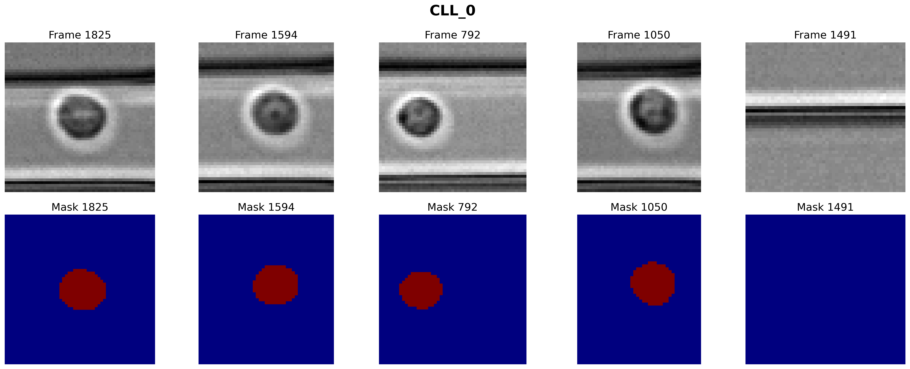
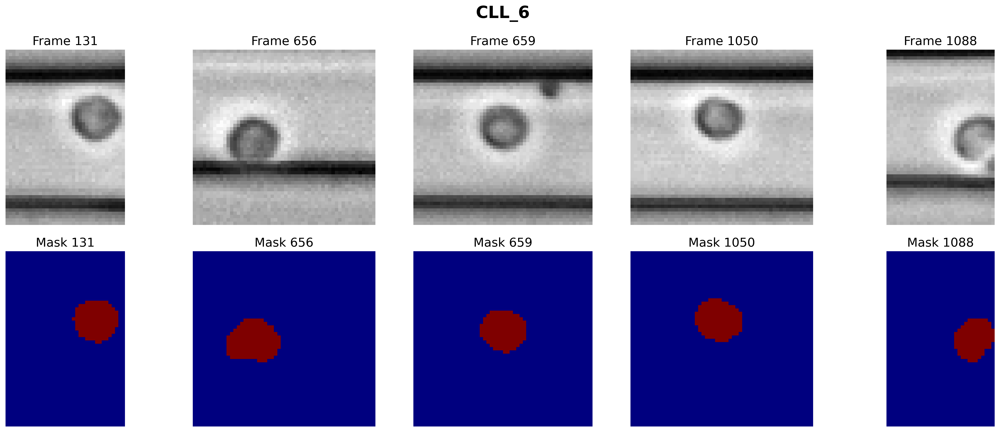
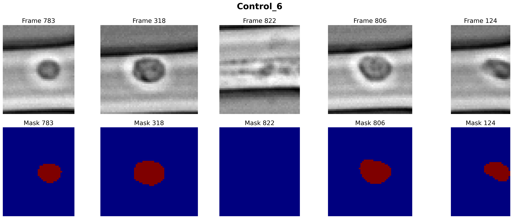
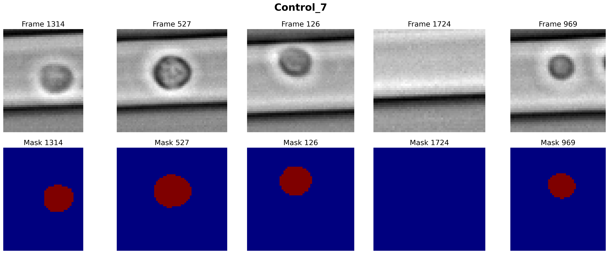
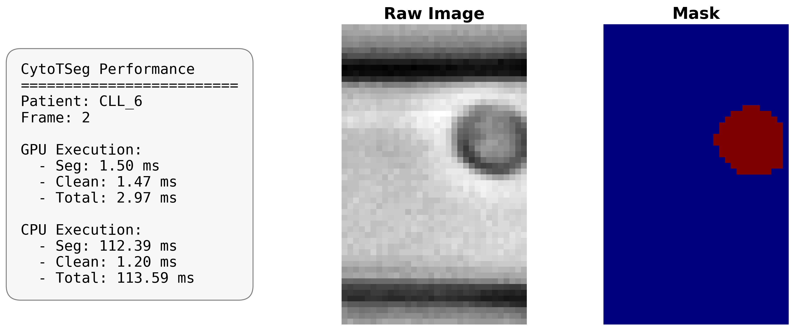
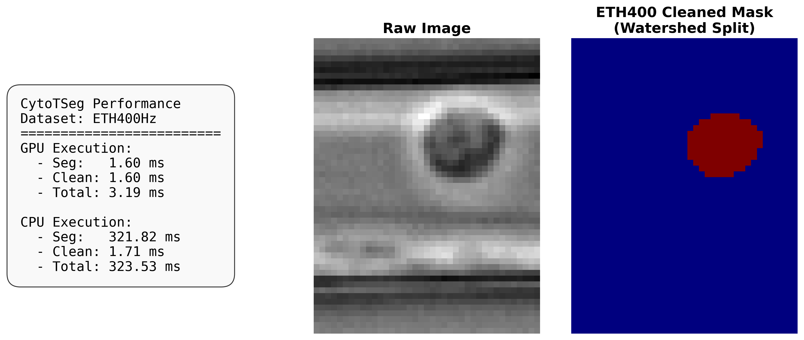

# CytoTSeg: Teacher-Student Segmentation for High-Throughput Cytometry

**CytoTSeg** is a robust teacher-student segmentation framework specifically engineered for bright-field, deformability, and imaging flow cytometry. It addresses the "bottleneck" of high-throughput single-cell analysis: the requirement for pixel-level accuracy at acquisition-speed inference rates.

---

## 🚀 Core Methodology

The framework optimizes the trade-off between segmentation quality and computational efficiency through a two-stage distillation process:

1.  **Teacher Selection:** High-capacity models (the "Teachers") are benchmarked offline against expert-annotated reference masks to identify the most accurate segmentation source.
2.  **Knowledge Distillation:** The selected teacher generates pseudo-labels to supervise lightweight, compact **U-Net-based student networks**. 

---

## 📊 Results & Visualizations

### 1. Performance on ETH-CLL Dataset
Despite their significantly reduced parameter count, CytoTSeg student models successfully capture the complex morphological features required for disease classification. 

Below are the segmentation results from the **Best Student Model** compared across malignant (CLL) and benign (Control) samples:

| Sample Type | Patient Case 1 | Patient Case 2 |
| :--- | :--- | :--- |
| **CLL (Malignant)** |  |  |
| **Control (Healthy)** |  |  |

> **Key Finding:** The distilled student models maintain high fidelity to the cell boundaries and morphological nuances of both healthy and leukemic cells, proving that highly compressed models can remain effective for downstream clinical phenotyping.

### 2. Inference Speed & Real-Time Deployment
A critical requirement for live microfluidic sorting and acquisition-speed analysis is rapid inference. CytoTSeg's lightweight architecture ensures that models run exceptionally fast on standard hardware. 

As shown in the live application benchmarks below, the model achieves high-speed processing on CPUs and drops to **just a few milliseconds per frame on GPUs**, making it perfectly suited for near-real-time clinical diagnostics.

| Live Application Benchmark 1 | Live Application Benchmark 2 |
| :---: | :---: |
|  |  |

---

## 🔬 Beyond Pixels: Morphology Preservation

In cytometry, segmentation directly dictates the biological measurements. CytoTSeg evaluates performance across three critical tiers:

* **Overlap Metrics:** Standard Dice and IoU coefficients for mask accuracy.
* **Morphological Fidelity:** Preservation of area, deformation, aspect ratio, and solidity.
* **Downstream Utility:** Performance in classification tasks and disease-related phenotyping.

---

## 📅 Benchmarking Datasets

| Dataset Name | Modality / Context | Source |
| :--- | :--- | :--- |
| **ETH-CLL** | Viscoelastic deformability (CLL/Healthy) | [DOI: 10.5281/zenodo.20326516](https://doi.org/10.5281/zenodo.20326516) |
| **Guck-MDS** | RT-DC (Myelodysplastic Syndromes) | [Zenodo: 5655848](https://zenodo.org/records/5655848) |
| **Guck-WBC** | White Blood Cell classification | [MPL Repository](https://dcor.mpl.mpg.de/organization/raw_data_wbc_classification) |
| **ICellCNN-SS** | High-throughput imaging screening | [Zenodo: 5391155](https://zenodo.org/records/5391155) |

---

## ✍️ Authors & Affiliations

Developed by members of the **Claassen Group** at **University of Tübingen** and the **DeMello Group** at **ETH Zürich**, Institute for Chemical and Bioengineering.

## 📄 Citation

If you use this framework or the associated ETH-CLL dataset in your research, please cite:

> [Full Paper Citation Here]
> 
> **Dataset:** ETH-CLL (2026). High-throughput viscoelastic microfluidic mechanophenotyping data. Zenodo. https://doi.org/10.5281/zenodo.20326516