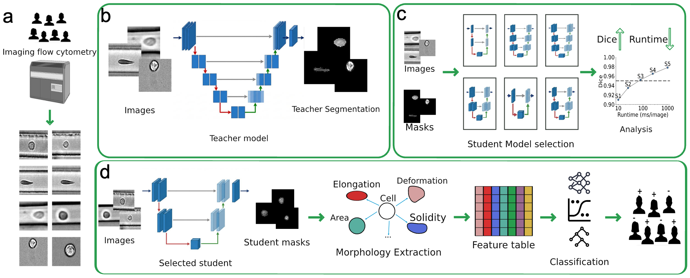
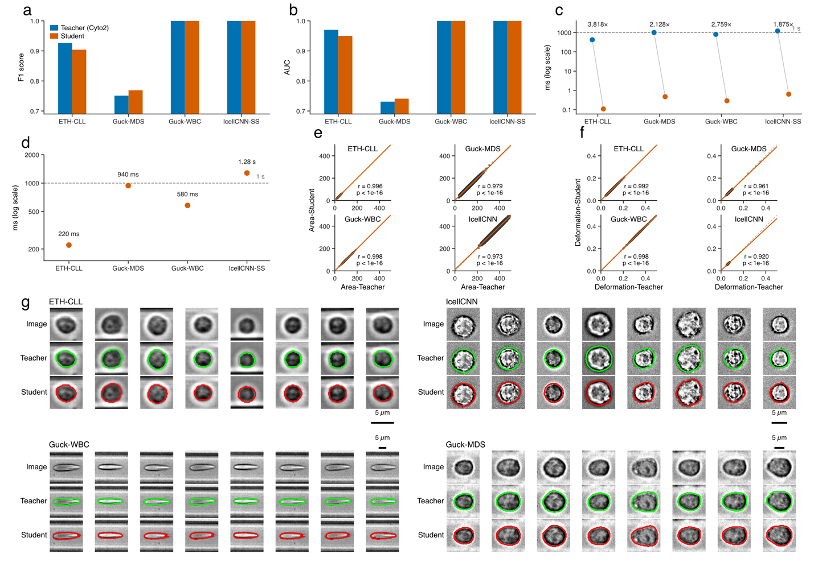

# CytoTSeg

### Efficient single-cell segmentation for imaging cytometry through teacher-student learning

[](https://www.python.org/)
[](LICENSE)
[](https://github.com/pourialaghayee/CytoTSeg/actions/workflows/ci.yml)
[](https://doi.org/10.5281/zenodo.20326516)

CytoTSeg transfers the segmentation behavior of a high-capacity teacher, such as Cellpose Cyto2, into a compact U-Net student. The goal is to retain useful cell boundaries and morphology while reducing the computational cost enough for high-throughput imaging flow cytometry and deformability cytometry workflows.



The repository now provides a configuration-driven pipeline that connects data preparation, normalization, teacher pseudo-label generation, mask cleaning, patient-level splitting, student-model search and training, evaluation, morphology extraction, and downstream classification.

## What is included

| Component | Purpose |
| --- | --- |
| `main.py` | Runs the complete workflow or a selected section from one JSON file |
| `Teacher_inference.py` | Generates Cellpose pseudo-labels; this bridge was previously missing |
| `Unet_train.py` | Multi-objective Optuna search and final compact U-Net training |
| `Unet_eval.py` | Batched inference, segmentation metrics, and runtime reporting |
| `Morphology_extraction.py` | Extracts cell size, shape, deformation, and related descriptors |
| `Classifier.py` | Evaluates patient-level morphology using nested cross-validation |
| `configs/eth_cll.example.json` | Reproducible starting configuration for ETH-CLL at 400 Hz |

All main scripts also have standalone command-line interfaces. Run `python <script>.py --help` to see their options.

## Reported study results

Across four public cytometry datasets, the selected students contained approximately **1,284 to 9,672 trainable parameters**, compared with about **6.6 million parameters** for the Cellpose Cyto2 teacher. In the manuscript benchmarks, the students achieved more than three orders of magnitude faster GPU inference and processed 2,000 images in under two seconds while preserving useful morphology and downstream classification performance.

These values are study results, not guaranteed performance on every computer. The reported timing experiments used an NVIDIA RTX A6000 GPU and 128 GB RAM under matched benchmarking conditions.



## Quick start

### 1. Clone the repository

```bash
git clone https://github.com/pourialaghayee/CytoTSeg.git
cd CytoTSeg
```

### 2. Create an isolated Python environment

```bash
python3 -m venv .venv
source .venv/bin/activate
python -m pip install --upgrade pip
```

On Windows PowerShell, activate it with:

```powershell
.venv\Scripts\Activate.ps1
```

### 3. Install PyTorch and the remaining dependencies

For a GPU installation, first choose the command that matches your CUDA version from the [official PyTorch installation page](https://pytorch.org/get-started/locally/). For a standard installation:

```bash
pip install -r requirements.txt
```

The workflow intentionally uses Cellpose 3 (`cellpose>=3.1,<4`) because the study teacher is the legacy Cyto2 model. Cellpose 4 uses a different model family.

### 4. Create your configuration

```bash
cp configs/eth_cll.example.json configs/eth_cll.local.json
```

Edit these two values first:

```json
{
  "data": {
    "raw_data_root": "/absolute/path/to/ETH_dataset_CytoTseg"
  },
  "run": {
    "work_dir": "../runs/eth_cll_400",
    "device": "auto"
  }
}
```

`device` may be `auto`, `cuda`, or `cpu`. The example file contains all available pipeline settings.

### 5. Inspect the planned commands

```bash
python main.py all --config configs/eth_cll.local.json --dry-run
```

This is a safe check: it prints every stage without running the models.

### 6. Run the complete workflow

```bash
python main.py all --config configs/eth_cll.local.json
```

Completed stages are skipped when their expected outputs already exist. This makes it possible to fix a later-stage problem and rerun the same command. Use `--force` only when you intentionally want to regenerate existing outputs.

## Expected ETH-CLL folder layout

The automated raw-data reader expects separate `CLL` and `Control` directories. Each patient may contain one or more acquisition directories whose name, or parent name, includes `400` or `1500`; the corresponding run must contain an `images` folder.

```text
ETH_dataset_CytoTseg/
├── CLL/
│   ├── CLL_0/
│   │   └── ...400.../
│   │       └── images/
│   │           ├── frame_0001.png
│   │           └── frame_0002.png
│   └── CLL_1/
└── Control/
    ├── Control_0/
    └── Control_1/
```

The reader searches recursively, so intermediate acquisition folders may differ as long as the frequency and `images/` directory are present.

## Pipeline stages

| Stage | Script | Main output |
| --- | --- | --- |
| `prepare` | `Data_preparation.py` | Patient-grouped image pickle |
| `normalize` | `Data_normalization.py` | 1st/99th-percentile normalized images |
| `teacher` | `Teacher_inference.py` | Cellpose instance-mask pseudo-labels |
| `clean-teacher` | `Cleaning.py` | Dataset-specific filtered pseudo-labels |
| `split` | `Train_test_split.py` | Patient-separated `train.pkl` and `test.pkl` |
| `train` | `Unet_train.py` | Optuna study, selected checkpoint, and model config |
| `evaluate` | `Unet_eval.py` | Student masks, Dice/IoU metrics, and timing |
| `clean-student` | `Cleaning_student.py` | Optional cleaned prediction pickle |
| `morphology` | `Morphology_extraction.py` | Per-cell features and patient-enriched pickle |
| `classify` | `Classifier.py` | Nested-CV reports, plots, and trained classifiers |

Run only one section when needed:

```bash
python main.py prepare  --config configs/eth_cll.local.json
python main.py train    --config configs/eth_cll.local.json
python main.py evaluate --config configs/eth_cll.local.json
```

You can also resume at a named stage:

```bash
python main.py all --config configs/eth_cll.local.json --from-step train
python main.py all --config configs/eth_cll.local.json --from-step evaluate --to-step morphology
```

## Output structure

A complete run is organized into numbered directories:

```text
runs/eth_cll_400/
├── 00_prepared/
├── 01_normalized/
├── 02_teacher/
├── 03_cleaned/
├── 04_split/
├── 05_student/
│   ├── checkpoints/best_model.pth
│   ├── config_unet_v2.json
│   ├── evaluation_results.json
│   ├── optuna_study.db
│   └── optuna_trials.csv
├── 06_predictions/
├── 07_morphology/
└── 08_classification/
```

Large data, checkpoint, and run files are ignored by Git so they are not committed accidentally.

## Using a custom teacher model

Set `teacher.model` in the JSON configuration to either `cyto2` or a trained Cellpose model path:

```json
"teacher": {
  "model": "/absolute/path/to/my_cellpose_model",
  "diameter": 13.5
}
```

To fine-tune the teacher first, use:

```bash
python Fine_tune_cellpose.py \
  --input /path/to/annotated_datasets.pkl \
  --output-dir runs/cellpose_teacher \
  --datasets eth400 eth1500
```

The annotated pickle must contain `db[dataset]["image"]` and `db[dataset]["GT"]` dictionaries with matching sample keys.

## Using another cytometry dataset

The supplied raw-image preparation script targets the ETH-CLL directory structure. Other datasets can enter the workflow after conversion to the patient-level pickle format below:

```python
database = {
    "patient_id": {
        "images": [image_1, image_2, ...]
    }
}
```

After normalization, the pipeline adds:

```python
database[patient_id]["normalized_images"]
database[patient_id]["cyto2_finetuned"]
database[patient_id]["cyto2_finetuned_clean"]
```

Dataset-specific mask-cleaning presets are available for `eth400`, `eth1500`, `guck2022`, `guck2025`, and `icellcnn`. For a genuinely new imaging domain, review the morphology thresholds in `Cleaning.py` before training.

## Qualitative examples

Green contours indicate teacher masks and red contours indicate student predictions.

| CLL | Control |
| --- | --- |
|  |  |
|  |  |

## Public datasets used in the study

| Dataset | Context and modality | Access |
| --- | --- | --- |
| ETH-CLL | Chronic lymphocytic leukemia; viscoelastic deformability cytometry | [Zenodo DOI 10.5281/zenodo.20326516](https://doi.org/10.5281/zenodo.20326516) |
| Guck-MDS | Myelodysplastic syndrome; real-time deformability cytometry | [Zenodo record 5655848](https://zenodo.org/records/5655848) |
| Guck-WBC | White blood cells; deformability cytometry | [MPL data repository](https://dcor.mpl.mpg.de/organization/raw_data_wbc_classification) |
| ICellCNN-SS | Sézary syndrome; imaging flow cytometry | [Zenodo record 5391155](https://zenodo.org/records/5391155) |

Datasets and pretrained model checkpoints are not bundled in this repository.

## Reproducibility and safety notes

- Patient-level separation is used to reduce leakage between training and test sets.
- The study configuration selects the largest CLL and Control patient for training. Set `single_patient_train` to `false` to use the configurable ratio strategy instead.
- Optuna studies are stored in SQLite and can resume until `n_trials` completed trials are available.
- The classifier requires enough patients from each class for the requested inner and outer folds.
- Python pickle files can execute code while loading. Use only datasets and checkpoints from sources you trust.
- GPU timing depends on hardware, drivers, batch size, image dimensions, and the selected student architecture.

## Repository layout

```text
.
├── configs/                     # Example pipeline configuration
├── Figures/                     # Workflow and manuscript visualizations
├── .github/workflows/ci.yml     # Syntax and dry-run checks
├── main.py                      # End-to-end orchestrator
├── Data_preparation.py
├── Data_normalization.py
├── Teacher_inference.py
├── Cleaning.py
├── Train_test_split.py
├── Unet_train.py
├── Unet_eval.py
├── Cleaning_student.py
├── Morphology_extraction.py
├── Classifier.py
├── Fine_tune_cellpose.py
└── requirements.txt
```

## Citation

If you use CytoTSeg, please cite the associated manuscript once its final bibliographic record is available:

> Laghaee S, Das S, Stavrakis S, deMello A, Claassen M. *CytoTSeg: Efficient Segmentation for Single-Cell Imaging Cytometry via Teacher-Student Learning*.

For use of the ETH-CLL data, also cite its [Zenodo dataset record](https://doi.org/10.5281/zenodo.20326516).

## License

This project is released under the [MIT License](LICENSE).
